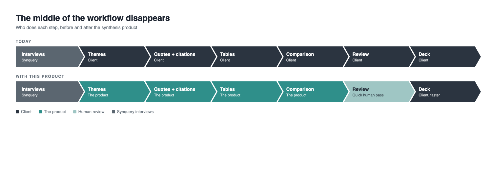
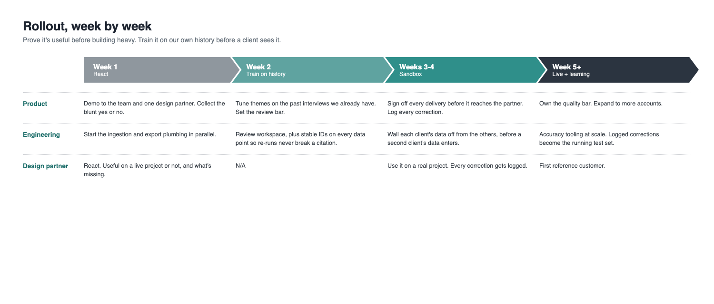

# Synquery Take-Home Writeup

## The goal

Today the client gets raw transcripts and has to mine them by hand. The goal here is that after Synquery runs a panel, the client opens one page that already answers their question, with every claim sourced, and pulls what they need straight into their deck. Three hour-long calls become slide-ready data instead of homework.

## Value added, the key principles

- **Everything is cited.** Every number and quote links to the exact moment it was said, so any claim survives a "says who" in a partner meeting.
- **Everything is structured.** Ratings, prices, rankings, and quotes become data, ready to drop into tables and slides instead of prose to mine.
- **Everything is comparable.** The same question across all the interviews lands in one view instead of three documents.

## Assumptions

- The interview guide already comes from the client's question. That's how Synquery works today.
- The interviews keep asking typed questions, rankings, 1 to 10 ratings, prices. That's what makes the Ratings and Numbers tab buildable.
- The client gives their question and a starting set of themes at kickoff.
  - This can stay light. They share their key questions, we propose a theme set back, they sign off. Some back and forth here is worth it. Early alignment on themes beats building the wrong structure, and the final structure stays subject to their confirmation.
- A human looks things over before anything goes out.

## What the prototype includes, by tab

- **Themes and Quotes.** Every finding is a row, who said it, the theme, the takeaway, the verbatim quote. Filter by theme or expert and you have the raw material for a slide in seconds, with the client's themes kept visually separate from the ones we added.
- **Ratings and Numbers.** All the typed answers laid out as tables, the vendor ratings matrix, prices, commercial terms, loyalty and switching. This is where three separate conversations become one comparison.
- **Transcripts.** The full calls, cleaned and redacted. Every number and quote in the product clicks through to the exact moment here, which is what makes the rest of it defensible.
- **Coverage.** What this panel can and can't support, stated plainly. It keeps a claim the data can't back off the client's slide, and it points at which interviews to run next.
- **Summary.** Five claims a client might actually put on a slide, each with a verdict, supported, supported with caveat, or not supported by this panel, and a footnote written to paste under the slide.

## The workflow it takes over

The middle of the client's workflow disappears. They go from mining transcripts to reviewing findings and building their deck.

## Why this has lasting value a client can't build themselves

The client brings their **question** and their **starting themes**. The product pulls **its own themes** on top, clearly marked as ours. And Synquery can get **smarter with themes** because of a **volume** of interview analysis that no single client ever has.

## Where AI does the work, and where it's plain software

- AI handles the parts that need reading. Finding a rating or a price inside a conversational answer, matching a quote to a theme, wording a takeaway. Judgment work.
- Plain software handles the parts that have to be exactly right. Averages, counts, checking that a quote matches the transcript word for word, swapping employer names for placeholders. Ordinary code, same answer every run, nothing invented.
- The split exists because a language model can occasionally make things up and ordinary code can't. So nothing a model wrote ever becomes a number. Models find and phrase. Code counts and checks.
- Extracted data points are stored with their quote and timestamp, and every table is computed from them. Interview four updates every view without touching interviews one through three.

## Additional callouts

- It flags data problems instead of papering over them. A rating given as 9 out of 10 on a question asked 1 to 7 gets held out of the averages, not blended in.
- Every build re-checks every citation against the transcripts before anything renders. A broken link fails the build instead of reaching a client.

## The rollout, week by week

**What those builds actually are, concretely.**

- **Ingestion.** In the prototype I placed transcript files in a folder by hand. The real build is a connector to the interview platform. A call ends, the transcript lands in the right project on its own, gets a cleanup pass, speaker labels, timestamps, name redaction, runs through extraction, and appears in the review queue. Nobody moves files.
- **Export.** Today you can copy a claim with its citation. The real build is one click out, a slide-ready table or chart with the footnote attached, and a spreadsheet of the underlying data points, so numbers move into the client's deck without anyone retyping them.
- **Review workspace.** A screen where the reviewer walks every takeaway and verdict with approve, edit, and reject, and only signed-off content ever publishes. It also keeps the record of who approved what and when, which matters the moment a client questions a claim.
- **Stable IDs.** Every extracted data point gets a permanent ID. When we re-run extraction with a better model, existing citations keep pointing at the right moment in the right call instead of breaking in a deck the client already shipped.
- **Client separation.** Each client's projects live in their own walled space, enforced at the data layer rather than hidden behind a setting. This has to exist before the second client's data arrives, not after.
- **The accuracy loop.** Every reviewer correction gets saved as a test case. Before any change to extraction or theme-pulling ships, it runs against that growing set, so the product provably gets better instead of just different.
